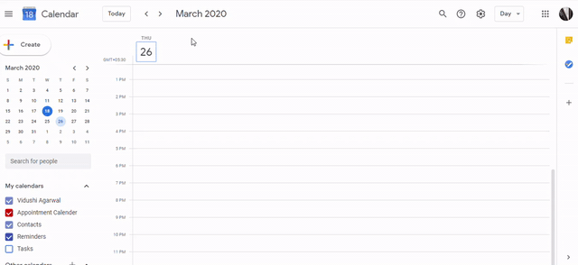

# Appointment Scheduler

## Setup Instructions
### Dialogflow and Fulfillment Setup

#### Service Account Setup
1. In [Dialogflow's console](https://console.dialogflow.com), go to settings ⚙ and under the general tab, you'll see the project ID section with a Google Cloud link to open the Google Cloud console. Open **Google Cloud**.
1. In the Cloud console, go to the menu icon **☰ > APIs & Services > Library**
1. Select **Google Calendar API** and then **Enable** to enable the API on your cloud project.
1. Under the menu icon **☰ > APIs & Services > Credentials > Create Credentials > Service Account Key**.
1. Under **Create service account key**, select **New Service Account** from the dropdown and enter `AppointmentCalendar` for the name and click **Create**. In the popup, select **Create Without Role**.
    + JSON file will be downloaded to your computer that you will need in the setup sections below.

#### DMV Appointment Calendar Setup
1. Open the JSON file that was downloaded in the previous section and copy the email address indicated by the `client_email` field
```js 
// Ex:
appointment-scheduler@${PROJECTID}.iam.gserviceaccount.com
```
1. [Open Google Calendar](https://calendar.google.com). On the left, next to **Add a friend's calendar** click the **+** and select **New Calendar**
1. Enter `Appointment Calendar` for the name of the calendar and select **Create Calendar**. Next, go to the `Appointment Calendar` calendar that will appear on the left column.
1. Paste the email copied from the previous step into the **Add people** field of the **Share with specific people** section and then select **Make changes to events** in the permissions dropdown and select **Send**.
1. While still in Settings, scroll down and copy the **Calendar ID** in the **Integrate Calendar** section.

#### Add Service Account and Calendar ID to Fulfillment
Go to the `index.js` file in [Dialogflow's Fulfillment section](https://console.dialogflow.com/api-client/#/agent//fulfillment)

Take the **Calendar ID** copied from the prior section and replace `<INSERT CALENDAR ID HERE>` on line 24 of `index.js`.
```js
// Ex:
const calendarId = 'xxxxxxxxxxxxxxxxxxx0@group.calendar.google.com';
```
Next copy the contents of the JSON file downloaded in the "Service Account Setup" section and paste it into the empty object on line 25 of `index.js` `const serviceAccount = {}`.
```js
//Ex:
    const serviceAccount = {
      "type": "service_account",
      "project_id": "sample",
    ...
  };
```
Click **Deploy** at at the bottom of the page.


## Running the sample
In [Dialogflow's console](https://console.dialogflow.com), in the simulator on the right, query your Dialogflow agent with `Set an appointment at 4pm tomorrow for drivers license` and respond to the questions your Dialogflow agent asks.   After getting the required information, an appointment will be added to the "Appointment Calendar" calendar.


## License
See [LICENSE](LICENSE).


